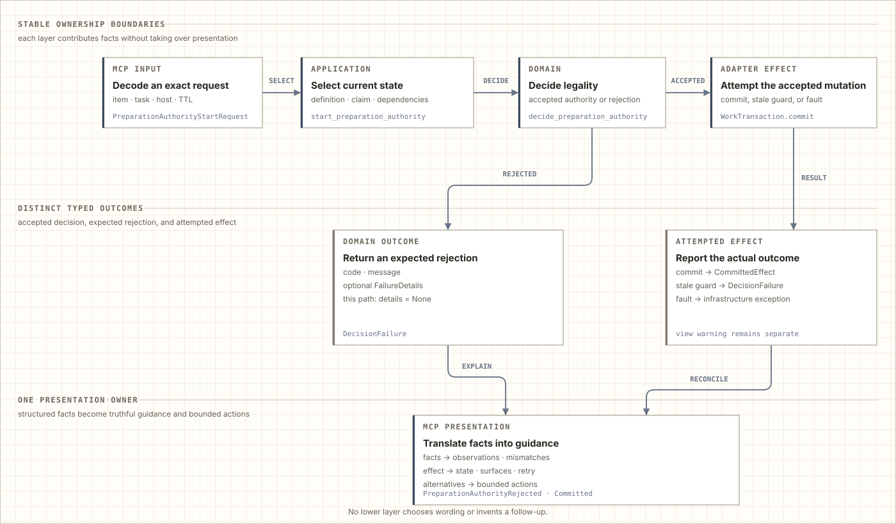

<!-- Generated by docs.how_it_works from executable seeds. Do not edit this file directly. -->

# How Pinboard works

Pinboard keeps long-running coding-agent work attached to the decisions that shaped it. It adds a repository-local record of proposed ideas, accepted work, implementation attempts, and review evidence without asking you to maintain a parallel ticket system.

For a short disposable change, working directly with a coding agent is often enough. Pinboard becomes useful when work crosses conversations, interruptions, reviewers, or parallel tasks and the latest chat is no longer a reliable account of why the code looks the way it does.

## One accepted direction anchors the loop

A coding agent already works through interpretation: it reads a request, changes the repository, reviews the result, and turns findings into another pass. As the loop grows, a plausible implementation detail or reviewer suggestion can quietly become the new target.

<picture>
  <source media="(prefers-color-scheme: dark)" srcset="assets/how-it-works/review-loop-dark.svg">
  
</picture>

Pinboard anchors that loop to one accepted direction. Cross-boundary work receives an independent review of its published brief before implementation. Findings lead to bounded corrections, republication, and another check of the corrected brief. Local work uses a lighter brief and skips this separate brief review.

After implementation, Pinboard prepares review context that binds the accepted brief, exact candidate, result, and any selected earlier evidence. A separate reviewer then examines that candidate against the brief. Preparing the context is not the review: it may publish an immutable prompt, but it neither judges nor accepts the implementation. Implementation defects return to the same attempt for correction and another review. A gap in the brief or an unresolved product decision goes back to its owner before implementation continues.

The human still decides what belongs in the product, which tradeoffs are acceptable, and what should happen to reviewed repository changes. Pinboard preserves those decisions and returns material choices in ordinary language.

## The brief makes the agreement inspectable

Before implementation, Pinboard turns accepted direction into a structured brief. It separates the desired outcome from scope, exclusions, compatibility constraints, evidence, verification, and work deliberately left for later. Cross-boundary work also names the project authorities and relationships the implementation and review must preserve.

<picture>
  <source media="(prefers-color-scheme: dark)" srcset="assets/how-it-works/brief-dark.svg">
  
</picture>

The diagram expands the cross-boundary form. A local checkpoint retains acceptance criteria, architecture impact, verification, and deferrals without the additional authority, contract, coverage, and lifecycle records. It applies only when ownership, dependency direction, stored and wire identities, and independent consumers remain unchanged and one entry point exposes the complete change.

The structure prevents important kinds of information from disappearing into a paragraph. It does not decide what the project should want or prove that every claim is true. People and coding agents still interpret the evidence; Pinboard checks that they are discussing the same accepted scope and that required distinctions have not been omitted.

Assurance follows that accepted product evidence. A defect against promised behavior remains blocking. A broader security, compatibility, durability, or platform guarantee does not become mandatory merely because an agent can imagine it.

## Work survives its current execution

A **work item** is the durable project decision. An **attempt** is one execution of that work. Keeping them separate allows the decision to survive a pause, correction, replacement worker, or later revision without treating every execution detail as part of the product request.

<picture>
  <source media="(prefers-color-scheme: dark)" srcset="assets/how-it-works/product-dark.svg">
  
</picture>

Ideas can be preserved before they are accepted or scheduled. Accepted work can wait for dependencies, move through implementation and review, pause at a useful checkpoint, return for correction, continue, or finish. A proposed replacement remains a related decision rather than becoming a hidden state: Pinboard keeps obsolete work from advancing until the human chooses whether to replace it or retain it temporarily.

Across those paths, four guarantees stay constant:

- **Intent survives conversations.** Later work can continue from accepted scope and evidence instead of reconstructing intent from chat history.
- **Only the current worker may act.** Replaced or expired execution authority cannot apply an earlier decision after ownership changes.
- **Review concerns one candidate.** Findings and acceptance stay bound to the exact result that was examined.
- **Authoritative changes are atomic.** A rejected or failed transition leaves the previous ledger intact; repairable views cannot silently rewrite accepted state.

## One operation moves through the layers

Starting a preparation claim is one representative operation. The request is decoded, the current definition and claim are selected under a transaction, and a pure decision accepts or rejects the change. An accepted mutation is committed before replaceable views are refreshed and the result is presented.

<picture>
  <source media="(prefers-color-scheme: dark)" srcset="assets/how-it-works/journey-dark.svg">
  
</picture>

The same separation keeps a failed view refresh from undoing an accepted transaction. Preparation, implementation, and review use these boundaries while preserving the accepted work and its evidence.

## Exact outcomes make the next move clear

An agent needs to know what happened, whether anything changed, and how it can continue. Pinboard carries those answers through the same preparation-start path instead of collapsing them into an opaque message.

<picture>
  <source media="(prefers-color-scheme: dark)" srcset="assets/how-it-works/outcomes-dark.svg">
  
</picture>

An expected rejection preserves observations, mismatches, effect, changed surfaces, retry disposition, and bounded alternatives. An attempted effect likewise preserves durable truth: a successful claim is exact, an infrastructure failure reports whether anything committed, and a later view warning does not undo the accepted transaction.

Each layer therefore reasons over a bounded set of facts without erasing the decision-relevant provenance needed by the next owner. The interface owns the final wording and supported next action; lower layers report what they know rather than inventing presentation policy.

If accepted direction changes late, Pinboard does not reinterpret the old candidate as satisfying the new request. The complete definition and brief are replaced before another candidate and review. If work pauses or a worker disappears, the same attempt can resume from its accepted Git lineage and recorded evidence without retelling the project history.

The extra steps make a first delivery slower. Their return appears when the work needs another revision, conversation, reviewer, or task: the decision, implementation, and evidence remain connected.

## The repository keeps the memory

Pinboard stores project coordination data beside the repository. The relational ledger groups current work, accepted scope and dependencies, discoveries, immutable knowledge, current execution authority, and history.

<picture>
  <source media="(prefers-color-scheme: dark)" srcset="assets/how-it-works/database-dark.svg">
  
</picture>

SQLite is the authority. Accepted briefs, results, and reviews are immutable artifacts referenced by that ledger. Human-readable Markdown views are replaceable projections for inspection; if refreshing one fails, the accepted transaction remains authoritative and the view can be rebuilt.

This local record supports recovery and review, but it is not a defense against a hostile user with the same filesystem access. Pinboard is designed for one trusted local developer authority and for failures such as stale actions, invalid input, interrupted publication, and ordinary concurrency.

## Handover carries facts, not control

When work must move to another tool, Pinboard can assemble the admitted work, accepted definitions, attempts, proposals, relationships, decisions, and verified evidence into one portable package.

<picture>
  <source media="(prefers-color-scheme: dark)" srcset="assets/how-it-works/handover-dark.svg">
  
</picture>

The package captures one coherent project revision. It does not export live worker authority, mutate Pinboard, choose how the receiving tool represents the facts, or write into that tool. A human or the receiving system owns that mapping.

## Responsibility stays visible

Pinboard keeps product decisions, operation sequencing, persistence, and external presentation in four package layers.

<picture>
  <source media="(prefers-color-scheme: dark)" srcset="assets/how-it-works/layers-dark.svg">
  
</picture>

Every arrow means “may depend on.” Interfaces make outside input exact and present results. Application code coordinates complete operations through explicit capabilities. The domain decides legality without reading files or issuing SQL. Adapters store and recover accepted facts without deciding workflow policy.

That separation is why a storage failure cannot redefine a product decision, a renderer cannot become the source of truth, and an interface cannot silently invent lifecycle policy.

For installation and the product overview, return to the [README](README.md). Maintainers can continue with the exact [architecture map](ARCHITECTURE.md) and the [design principles](DESIGN_PRINCIPLES.md).

---

This guide and its eight SVG diagrams are generated from the executable seeds in <code>docs/how_it_works/</code>. Edit the seeds and regenerate the outputs; do not edit this file directly.
