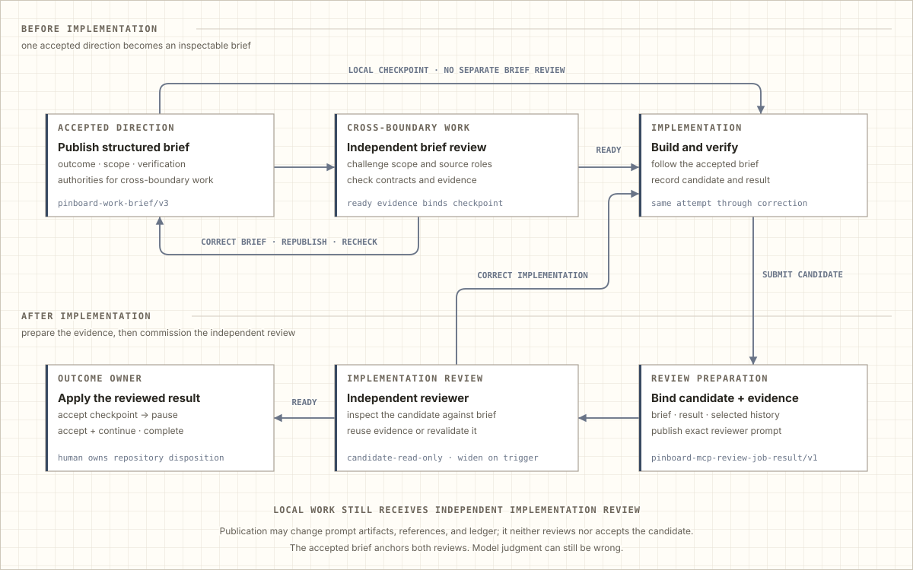
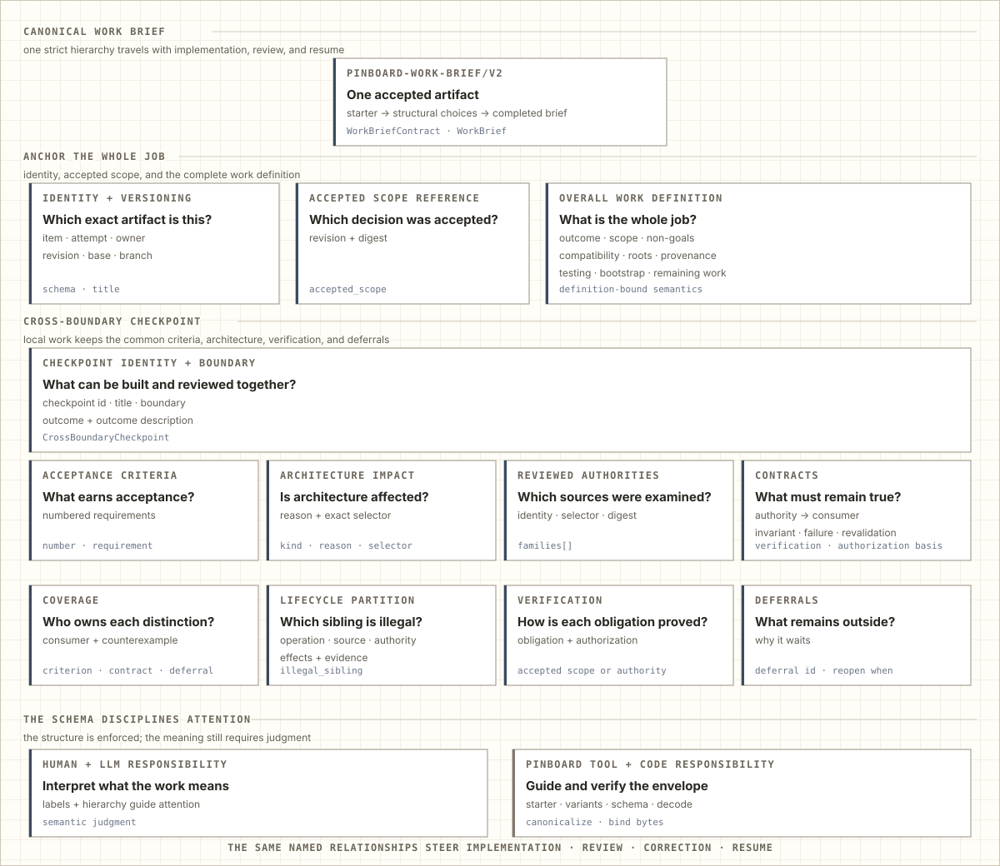
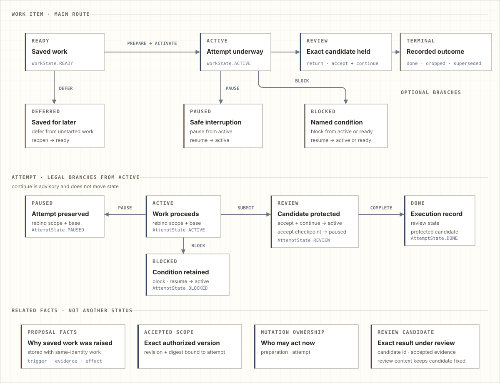
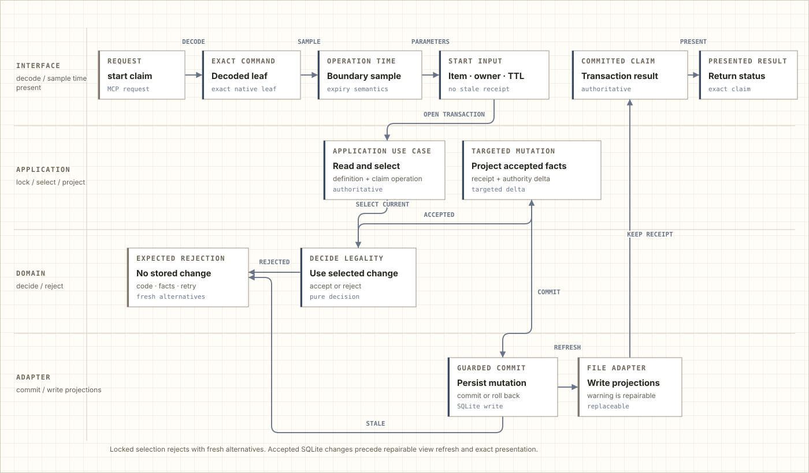
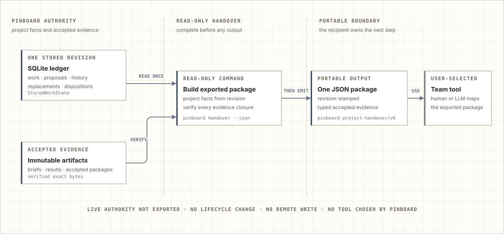
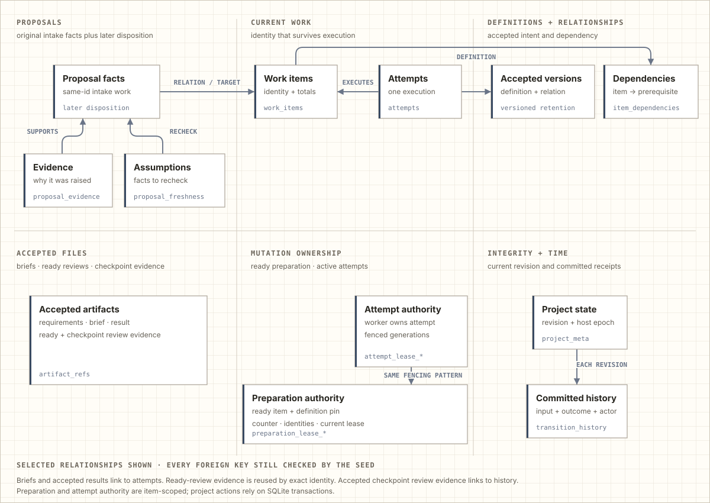
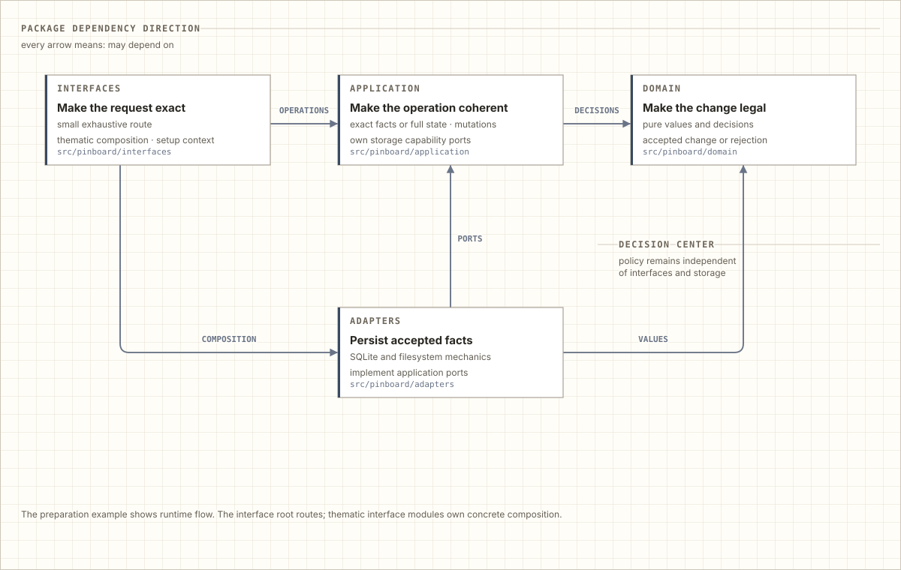

<!-- Generated by docs.how_it_works from executable seeds. Do not edit this file directly. -->

# How Pinboard works

Pinboard adds one repository-local ledger of proposals, accepted work, attempts, and evidence to long-running Codex work. It preserves what the human requested, what an agent proposed, what the project accepted, which execution is acting on it, and what evidence a reviewer can trust later.

For one short, isolated change, Codex already supplies the planning, implementation, testing, and review loop. Pinboard adds deliberate steps when the project must remain coherent across discoveries, parallel tasks, interruptions, and later iterations.

## Contents

- [Workflow at a glance](#workflow-at-a-glance)
- [Why Pinboard changes the Codex loop](#why-pinboard-changes-the-codex-loop)
  - [Codex already iterates](#codex-already-iterates)
  - [Strict shape, semantic judgment](#strict-shape-semantic-judgment)
- [The product model](#the-product-model)
  - [Work items and attempts](#work-items-and-attempts)
  - [What every transition preserves](#what-every-transition-preserves)
- [Command stories](#command-stories)
  - [Read, validate, initialize, and repair](#read-validate-initialize-and-repair)
  - [Follow one change](#follow-one-change)
  - [Apply one project change](#apply-one-project-change)
  - [Carry the project into another tool](#carry-the-project-into-another-tool)
- [Under the surface](#under-the-surface)
  - [The durable memory underneath](#the-durable-memory-underneath)
  - [Where responsibilities live](#where-responsibilities-live)

## Workflow at a glance

The practical path is short enough to tell without the data model:

1. **Preserve a discovery.** Intake records its trigger, evidence, hypothesis, and likely effect without changing current priority or adding it to the active feature.
2. **Accept exact work.** A project task decides which proposal belongs in the product, records the complete current definition, and keeps unaccepted ideas visibly separate.
3. **Prepare the brief.** A renewable preparation claim reserves that exact ready definition while one canonical brief is compiled and reviewed. The item does not become active yet.
4. **Implement that brief.** Activation binds the accepted brief to one attempt. The worker claims the attempt, rereads the brief, and changes the ordinary repository in its assigned checkout.
5. **Reconcile late direction.** Before candidate presentation or acceptance, the owning task accounts for user direction and repository changes since the accepted brief. A changed product target replaces the complete definition and brief, invalidates stale candidate or review identity, and requires another exact candidate and review.
6. **Submit one candidate.** The worker records the exact candidate and its evidence. Submission protects that identity instead of asking review to infer what changed from the latest files.
7. **Review the same decision.** A separate Codex reviewer compares that candidate with the same accepted brief and returns it for correction, accepts a checkpoint, or continues the attempt. The owning task then asks the human to choose repository disposition and confirm completion before the work becomes terminal.
8. **Recover without retelling.** Pause and block preserve the attempt and its evidence. Rebind corrects an active or paused attempt's branch, base revision, and matching brief without changing its lifecycle state, while fencing its previous worker. Resume requires a brief matching the current definition, so a later task cannot quietly continue obsolete scope.

This normally takes more turns than asking Codex to implement and review a prompt directly. The extra work is the mechanism: discoveries remain proposals, implementation rereads accepted scope, and review receives the exact brief and candidate. Pinboard trades first-delivery speed for a durable boundary between the product you accepted and the plausible additions an agent could otherwise accumulate.

## Why Pinboard changes the Codex loop

### Codex already iterates

A coding harness turns prose into code through interpretation. An implementer reads the request and repository, produces a change, and a reviewer interprets the request and result again. Review findings become new prose for another implementation pass. Codex already supplies this productive back-and-forth.

When the only shared target is the evolving conversation and latest diff, each pass can give new weight to an implementation detail or useful reviewer suggestion. That does not make every untracked loop drift. The risk grows when work crosses more turns, tasks, interruptions, and adjacent discoveries.

<picture>
  <source media="(prefers-color-scheme: dark)" srcset="assets/how-it-works/review-loop-dark.svg">
  
</picture>

Pinboard gives both sides a stable reference. The implementer rereads the accepted brief, submits one exact candidate with evidence, and a separate reviewer receives that same brief and candidate. Correction returns to the same attempt, with blocking findings tied to accepted scope, criteria, or reviewed project authority. If later accepted direction changes the target, the old candidate and review no longer qualify for wrap-up: the complete definition and brief are replaced before another exact candidate and review. The loop still depends on LLM and human judgment and can still be wrong; its corrections remain aimed at an explicit accepted target instead of whatever prose happens to be most recent.

### Strict shape, semantic judgment

**The brief is an information architecture, not a bag of prose.** Artifact identity and accepted-scope identity anchor the whole job. The work definition separates outcome, scope, non-goals, compatibility, provenance, testing, bootstrap, and remaining work. Its checkpoint then names the reviewable boundary and expands it into criteria, architecture impact, reviewed authorities, contracts, coverage, lifecycle distinctions, verification, and explicit deferrals. Those relationships tell an implementer what to build and give an independent reviewer the same map for challenging it.

<picture>
  <source media="(prefers-color-scheme: dark)" srcset="assets/how-it-works/brief-dark.svg">
  
</picture>

**Code checks the envelope; humans and models interpret the meaning.** The canonical work brief is strict JSON and the sole semantic brief. Pinboard rejects unknown fields and cross-checks identities, references, coverage, and canonical bytes. It cannot prove that prose under `scope` is truly in scope or that a `non_goals` entry expresses the human's intent. The model interprets those meanings, the human accepts the product decision, and independent review challenges the compiled result. The schema makes distinct reasoning jobs difficult to omit and stable across stages without pretending to replace judgment.

**Project impact remains a judgment too.** Pinboard has no rule saying that a visitor-facing decision must also change a workflow guide or a durable design principle. Structured scope, provenance, reviewed authorities, and coverage help Codex reason toward affected surfaces without a hard-coded file map or an exhaustive reread. The model can still miss or invent a connection; human acceptance and independent review decide whether it is real. This is information architecture refined through experience, not a semantic consistency engine.

The rest of this guide moves from the product concepts a visitor encounters to representative command stories, then to the storage and package structure underneath.

## The product model

### Work items and attempts

A work item is the durable project decision. An attempt is one execution of that work. They move together while remaining separate: an item can survive interruption, correction, or a replacement worker without losing its identity or accepted scope.

<picture>
  <source media="(prefers-color-scheme: dark)" srcset="assets/how-it-works/product-dark.svg">
  
</picture>

**The main lifecycle stays familiar.** Intake becomes ready, active work enters review, and accepted work reaches a terminal outcome. Deferred, paused, and blocked work are optional branches. Review can request correction, pause at an accepted checkpoint, or accept the candidate and continue. The owning task reconciles later direction, presents the accepted candidate for a repository decision, and records terminal completion only after the human confirms that disposition. Completion can also be accepted directly from active work after the same reconciliation and confirmation.

**Recovery preserves the right identity.** Resume makes a retained attempt active, while an item without one becomes ready. Reopen returns deferred work to intake with new evidence. Continue is advisory: it confirms that active work proceeds without changing lifecycle state or accepting mutation input. The action record's stable `effect` field describes that lifecycle effect; it does not claim that a wider command such as dispatch performs no artifact I/O. Dispatch can publish or reuse review evidence while leaving lifecycle unchanged.

**Pause records a deliberate interruption; it does not invent a blocker.** Suppose an urgent prerequisite must take priority while the current attempt is still technically runnable. Without pause, that attempt remains active and eligible for continuation or redispatch even though the human intends it to stop. Pause instead keeps the same attempt, retained lease, accepted brief, and evidence while removing runnable actions. Pause does not fence that lease. Rebind serves a different purpose: it corrects the branch, base revision, and matching brief while preserving either active or paused state, and it fences the prior worker generation. A later resume restores the same paused attempt without claiming that a dependency blocked it.

**Related facts are not extra states.** Proposal intake stores the original facts and creates same-identity `intake` work. Accept applies selected details to that item; merge supersedes it in favor of another; return keeps it in intake with a clarification reason; reject drops it. Accepted scope is the exact authorized revision an attempt uses. Mutation ownership records who may act now. A review candidate names the exact result under review, and evidence supports its acceptance.

### What every transition preserves

The lifecycle is accompanied by four guarantees:

- **Work survives conversations.** A later task can continue from accepted scope and evidence instead of reconstructing intent from chat history.
- **Mutation ownership is current.** An expired or replaced worker cannot apply an action it discovered earlier.
- **Review is about one candidate.** Correction, checkpoint acceptance, continuation, and terminal completion preserve different outcomes without changing which work they belong to.
- **Each authoritative change is atomic.** An accepted change updates its related facts and history together; a rejected or failed change leaves the previous ledger intact.

These guarantees explain why seemingly similar words remain distinct.

## Command stories

The command stories move from observation and repair to an ordinary mutation and portable export.

### Read, validate, initialize, and repair

- **Inspect one snapshot.** The command line decodes one exact leaf, root resolution selects the source checkout, shared repository, and work directory, and the interface samples time when lease expiry matters. It reads one complete SQLite snapshot, asks application code to project the requested status, overview, item, definition, history, action, or parallel view, and presents that result. Inspection neither refreshes generated files nor changes authority. `input-contract` is deliberately different: it describes static action semantics and payload shape from the selected action kind without opening project state.

- **Validate before repairing.** `status` is a bounded summary of one current snapshot, not the full integrity check. `validate` verifies accepted brief content, every accepted artifact identity, and every replaceable generated view against the bytes that snapshot should produce. Authoritative defects are errors; missing or stale generated views are warnings because SQLite and accepted artifacts remain the source of truth. Validation only reports. `views rebuild` separately derives and replaces every queue, item, attempt, and history projection from one snapshot and verified brief content.

- **Initialize through a verified publication.** A new ledger is built and verified in a staging file before atomic publication. A returning ledger is schema-checked before Pinboard reconciles only its own same-file publication residue and ensures its directories. Both routes use explicit roots and one operation time, then verify accepted brief content, rebuild generated views, and present the receipt. A failed rebuild leaves the authoritative database available for retry. After a successful first initialization, the interface points once to the optional `$repository-readiness`, `$slop-cleanup`, and `$maintaining-agent-guidance` skills without running them or creating work. It may separately recommend one absent Codex long-task default; neither path writes configuration or claims to override trusted project settings. Resumed and failed initialization stay quiet, while unreadable or malformed user config suppresses only the setting recommendation.

- **Plan reviewed sources without opening the ledger.** `brief-sources` reads one strict manifest, selects whole files or unique Markdown headings from the chosen source checkout, rejects overlaps and oversized lines, assigns every selected byte to one ordered segment and batch, and presents the complete plan or one requested batch. It never edits the project.

### Follow one change

**Observe and resolve.** Acquiring a preparation claim begins when the command-line boundary decodes an exact acquisition command. The preparation interface observes the exact item and definition preconditions, then resolves them with the requested task, host, lease, and lifetime into one requested change. Observation can explain an absent or changed precondition, but it is not the authoritative state that approves the change.

**Decide and commit against locked state.** The application opens the write transaction and rereads current state. A pure domain decision returns an accepted authority change or an expected rejection. The application projects acceptance into one targeted mutation; SQLite commits only those guarded facts and returns their exact history and project revision. Rejection and stale guards are expected failures, infrastructure or programming failures remain exceptions, and every unsuccessful transaction rolls back.

<picture>
  <source media="(prefers-color-scheme: dark)" srcset="assets/how-it-works/journey-dark.svg">
  
</picture>

**Refresh and present afterward.** A failed replaceable-view refresh can warn without undoing the authoritative commit. Authority commands reload latest state to present the lease that now exists. Transition commands instead present the exact revision returned by their own commit, even if another writer advances the ledger before presentation. The representative code repeats the same provenance story: observed state becomes a requested change; the application owns locked state, accepted decision, targeted mutation, and commit; refresh and presentation follow.

### Apply one project change

Project actions are direct atomic ledger changes. The task applying the change supplies its task and host identity, and SQLite protects the authoritative transition. Rebinding is one such action: it changes the stored Git lineage and accepted brief atomically, never the source checkout itself.

1. **Prepare exact input.** `close` builds its terminal payload, item revision validates a complete proposed definition, and `transition` reads the selected action receipt and its matching payload.
2. **Reread, select, and commit.** The application opens one write transaction, rereads current state, reselects the exact legal action, decides it, and commits the change with the invoking task and host identity. A stale or illegal action returns without changing the ledger.
3. **Refresh replaceable views.** A successful commit refreshes only the affected projections. A warning leaves the authoritative transition stored for `pinboard views rebuild`. Presentation identifies that transition's exact revision.

### Carry the project into another tool

Local continuity and external handover are different jobs. `pinboard handover --json` captures one ledger revision, projects the supported project facts from it, verifies every referenced accepted artifact against its recorded identity and bytes, and emits one revision-stamped portable JSON package only after the exported package is ready.

<picture>
  <source media="(prefers-color-scheme: dark)" srcset="assets/how-it-works/handover-dark.svg">
  
</picture>

The package carries admitted work, accepted definitions, attempts, pending proposals, relationships, decisions, and accepted evidence without choosing how another system represents them. Live preparation claims, attempt leases, and their generations remain in Pinboard and are not exported. Handover changes no Pinboard state and does not choose or write to the receiving tool; a human or another tool owns that mapping.

## Under the surface

The final views explain what Pinboard retains and where the code assigns responsibility for changing it.

### The durable memory underneath

The relational ledger groups sixteen tables into six kinds of memory: current work, accepted scope and dependencies, discoveries, immutable knowledge, changing mutation ownership, and the history that connects them.

<picture>
  <source media="(prefers-color-scheme: dark)" srcset="assets/how-it-works/database-dark.svg">
  
</picture>

**Relational facts retain their history.** A work item survives attempts, and accepted versions preserve current scope and its revisions. Proposal evidence records why intake work was raised; freshness assumptions record which facts need another check. The original proposal remains attached to the work while disposition records its later accept, merge, return, or reject decision.

**Immutable artifacts enter through three paths:**

1. **Brief publication** strictly decodes and cross-validates the selected candidate, canonicalizes and publishes its bytes, accepts the stable reference in SQLite, and rebuilds generated views. Activation or resume then selects that accepted brief for the attempt.
2. **Dispatch preparation** validates the environment, optional prompt or review files, exact current action, accepted brief identity, and reviewed sources before choosing the local, existing-review, or new-review path. It may publish or reuse independent ready-review evidence by exact identity, renders the prompt, rechecks authority, and only then emits it. Dispatch prepares a prompt; it does not create a task. Declared permissions remain brief declarations, not grants enforced by Pinboard.
3. **Checkpoint acceptance** publishes the exact result and independent review, then atomically records the attempt result, accepted review evidence, lifecycle change, and receipt. Publication alone changes no lifecycle state; rejection or rollback preserves the previous relationships.

**Mutation ownership has two leased scopes:**

- A preparation claim keeps an item ready while one task compiles and reviews its definition-bound brief; activation consumes the claim when it creates the attempt.
- An attempt lease identifies the task, host, and lease that own one implementation attempt. Generations fence older preparation and attempt owners after transfer or revocation, while unrelated item-scoped leases remain independent.

Project actions carry the invoking task and host identity and commit directly under SQLite's write transaction. They do not establish a persistent project owner.

Project state holds the current revision. Committed history records each accepted input, outcome, and actor.

### Where responsibilities live

The package is split into four layers because each removes a different kind of ambiguity. The split keeps workflow policy out of storage and keeps external representations out of decisions.

<picture>
  <source media="(prefers-color-scheme: dark)" srcset="assets/how-it-works/layers-dark.svg">
  
</picture>

Every arrow in this view means “may depend on.”

- **Interfaces** absorb command lines, JSON, project files, and human-readable output. A small exhaustive entry point routes exact commands; thematic interface modules own composition that needs concrete adapters.
- **Application code** reads complete stored state through capabilities and projects an accepted decision into one targeted storage mutation.
- **The domain** decides legality as pure data.
- **Adapters** make accepted facts durable and recoverable.

These transformations prevent one layer from silently interpreting facts owned by another.

For installation and the product story, return to the [README](README.md). For contributor-facing ownership, storage boundaries, and representative command flows, continue to the [architecture map](ARCHITECTURE.md). The [design principles](DESIGN_PRINCIPLES.md) explain the method used to keep those boundaries explicit.

---

This guide and its SVG diagrams are generated from the executable seeds in <code>docs/how_it_works/</code>. The repository check proves that committed output is fresh and that the specific source relationships encoded by those seeds still hold.
