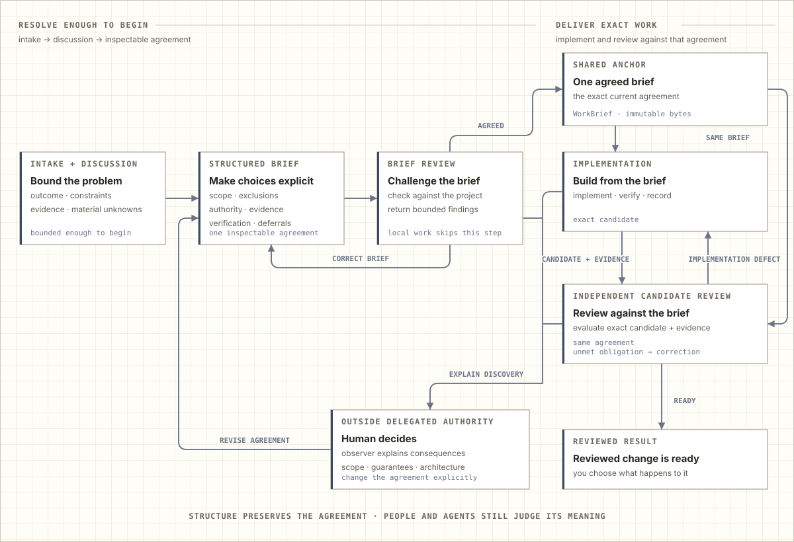
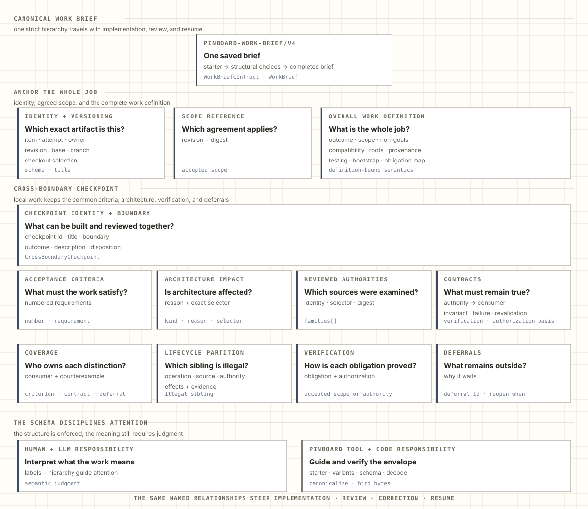
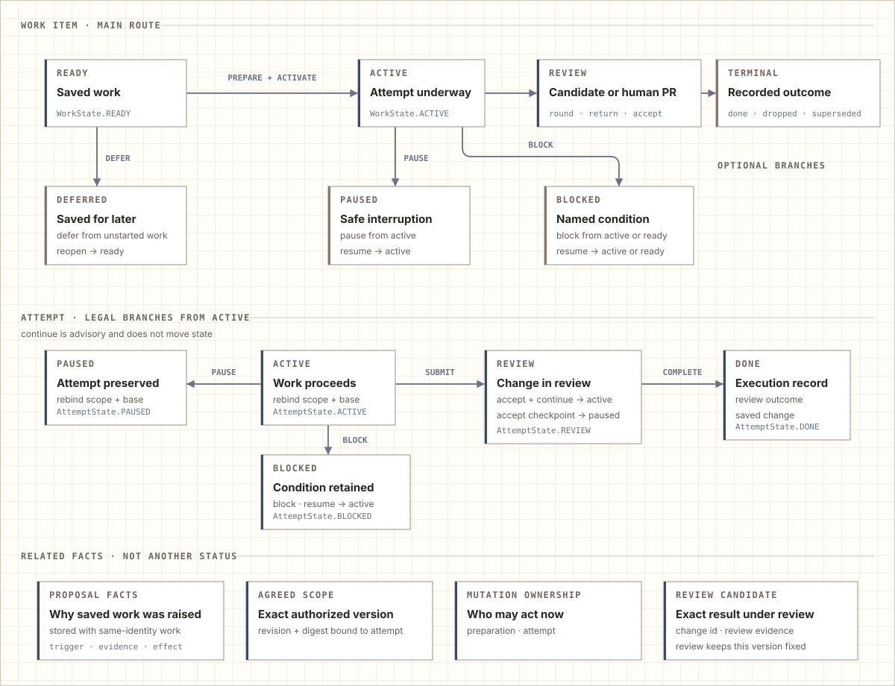
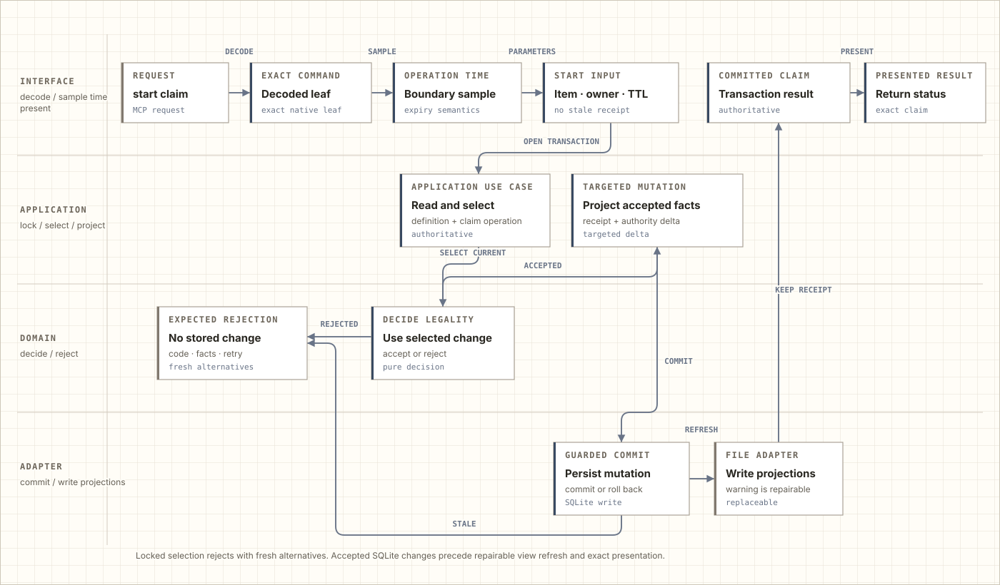

<!-- Generated by docs.how_it_works from executable seeds. Do not edit this file directly. -->

# How Pinboard works

Pinboard helps a person and a coding agent complete suitable development work while keeping its purpose and decisions understandable. The person chooses the outcome, priority, material tradeoffs, and what happens to a reviewed change. The agent preserves context, prepares and carries out authorized work, brings consequential choices back to the person, and arranges separate review.

Today's supported workflow is local to a Git-backed repository: Pinboard records accepted work, attempts, and evidence beside that repository. The wider product direction is to support suitable agentic work without making people learn Pinboard's internal workflow; it is not a claim that other kinds of projects are supported today.

For a short disposable change, working directly with a coding agent is often enough. Pinboard becomes useful when work crosses conversations, interruptions, reviewers, or parallel tasks and the latest chat is no longer a reliable account of why the code looks the way it does.

## What a saved item means

A **proposal** is a suggestion to preserve work. Saving it creates a **work item** under the same identity, with its original reason and evidence attached. The item records an **agreed outcome**: what should change, what is outside scope, and how the result will be judged. Saving an item does not start an attempt.

An item can be ready while current dependencies or holds still prevent a start. The agent checks **eligibility**, prepares the current definition and brief, and obtains **start authorization** before activation creates an attempt. These are separate steps. A **concern** names a possible gap or conflict; a **decision** settles a material choice with the person when it exceeds the agent's authority. **Evidence** records observations and supports a claim, but does not replace required independent review. **Delivery** is the candidate and its result for that review. **Completion** means the accepted outcome and required review are satisfied, the chosen repository disposition is handled when applicable, and Pinboard records the terminal result.

Here, **saved item** and **work item** name the same durable record. A proposal keeps its identity when saved, but it is not an active attempt. A ready item can still be ineligible to start. Brief review checks the delegated request; candidate review checks the exact change; a human review of a published pull request is a separate choice.

## Ambiguity closes around one accepted brief

Work begins with structured intake and discussion, not an implementation prompt assembled from the latest message. The human and agent make the outcome, constraints, evidence, and material unknowns explicit enough to form an inspectable agreement.

<picture>
  <source media="(prefers-color-scheme: dark)" srcset="assets/how-it-works/ambiguity-closure-dark.svg">
  
</picture>

The accepted brief anchors both implementation and review. Cross-boundary work receives an independent review of the brief before implementation; local work uses a lighter brief and skips that separate review. The worker then implements the accepted scope, verifies it, and submits one exact candidate with its evidence. A separate reviewer evaluates that candidate against the same brief.

Implementation defects return to the same attempt for bounded correction and another review. A discovery that changes product scope, architecture, compatibility, or another delegated boundary returns to the human. If the agreement changes, Pinboard replaces the complete definition and brief before affected implementation resumes; it does not reinterpret the old candidate as satisfying a new request.

The human still decides what belongs in the product, which tradeoffs are acceptable, and what happens to reviewed repository changes. Structure keeps those choices visible; it does not make them automatically correct.

A published pull request and Pinboard review are separate facts. If publication happens first, the owning task inspects the attempt, protects the exact local candidate, and starts review by a separate coding agent when the required actions are available. Until then, it reports review as not started or blocked; while review runs, it reports that work as underway; afterward, it reports a favorable verdict or a return for correction. A human may explicitly choose a PR review handoff before that agent review; this does not create Pinboard review evidence. Before presenting a merge choice, the agent reports the required review, hosted checks, and remote-head identity as observed or unverified. Pinboard checks local code identity: a reviewed working-tree change can become a clean commit on its recorded branch when the accepted base and exact preimage-to-commit binary diff still match. Reusing that review also requires accepted semantics and reviewed owner-consumer relationships to remain current. This local proof does not establish the published head, hosted checks, or merge.

## The brief makes delegation inspectable

Before implementation, Pinboard turns accepted direction into a strict structured brief. The artifact identifies the item, attempt, owner, branch, base revision, checkout, and exact accepted-scope revision and digest. Its whole-work definition records the outcome, scope, non-goals, compatibility, supported roots, provenance, testing strategy, bootstrap, and the mapping from accepted obligations to evidence.

<picture>
  <source media="(prefers-color-scheme: dark)" srcset="assets/how-it-works/brief-dark.svg">
  
</picture>

Each checkpoint states its outcome, acceptance criteria, architecture impact, required verification, deferrals, and whether accepted work continues or terminates. A cross-boundary checkpoint also binds reviewed authorities, contracts, consumer coverage, and lifecycle distinctions. A local checkpoint is valid only while ownership, dependency direction, stored and wire identities, and independent consumers remain unchanged and one entry point exposes the complete change.

This structure gives an agent a bounded job and gives the reviewer the same checklist. Exact accepted scope, exclusions, evidence limits, and remaining work survive a new session without relying on remembered chat. Pinboard validates shape, identity, references, and canonical bytes; people and language models still judge whether the facts and choices are sound.

### Agent actions stay explicit and bounded

The native MCP surface separates reading, authority, immutable publication, candidate observation, and lifecycle change. A few representative operations show how the brief governs the work:

- `proposal_create`, `brief_contract`, `brief_sources`, `brief_publish`, and `brief_review` preserve direction, construct the exact brief, select source evidence, and record independent brief findings.
- `actions` exposes only legal current operations and their exact payloads. `preparation_authority` and `attempt_authority` fence who may prepare or implement; `dispatch` publishes verified launch instructions without granting that authority.
- `artifact_verify` checks immutable accepted bytes. `candidate_observe` identifies the actual tracked working-tree candidate, and `review_job` binds that candidate, brief, result, and selected history into a separate reviewer launch.
- `attempt_inspect` exposes one attempt's current continuation. `candidate_restore` can restore its accepted candidate into an exact clean checkout, while `transition` alone applies a freshly discovered lifecycle mutation.

The complete surface also contains focused project and definition reads, priority and parallel planning, and status operations. The point is not the inventory: each operation has one advertised data scope and effect, so an agent cannot treat a convenient read, prompt publication, or stale receipt as mutation authority.

## Work survives its current execution

A **work item** is the durable project decision. An **attempt** is one execution of that work. Keeping them separate allows the decision to survive a pause, correction, replacement worker, or later revision without treating every execution detail as part of the product request.

<picture>
  <source media="(prefers-color-scheme: dark)" srcset="assets/how-it-works/product-dark.svg">
  
</picture>

Saving a proposal creates a ready work item with its original facts attached. A start request first leads the agent to check current dependencies and holds. Preparation then pins the definition and produces a brief; activation rechecks eligibility and authority before creating an attempt. Work can move through implementation and review, pause at a useful checkpoint, return for correction, continue, or finish. A proposed replacement remains a separate decision rather than silently changing the active target.

Across those paths, four guarantees stay constant:

- **Intent survives conversations.** Later work can continue from accepted scope and evidence instead of reconstructing intent from chat history.
- **Only the current worker may act.** Replaced or expired execution authority cannot apply an earlier decision after ownership changes.
- **Review concerns one candidate.** Findings and acceptance stay bound to the exact result that was examined.
- **Authoritative changes are atomic.** A rejected or failed transition leaves the previous ledger intact; repairable views cannot silently rewrite accepted state.

At the repository decision, you choose what happens to the reviewed change. When the chosen path includes integration, the agent verifies it, removes only the exact worktree and branches you authorized after checking that no needed work remains, and records terminal completion. Those steps can be authorized together when their effects are clear. A merge alone does not close the work item. If the change is already integrated, the agent checks the accepted outcome, candidate review, external evidence, and cleanup state; it reuses valid evidence and finishes the same attempt without creating an empty change.

## The same workflow, viewed through the codebase

Saving a proposal follows the story above. The MCP boundary decodes the proposal; the application reads current facts inside a write transaction; the domain decision gives the ready item the proposal's identity and accepted definition. SQLite commits those facts together, then the file adapter refreshes the new item view. The result reports the saved item and its position. No attempt is created by that path.

Starting a preparation claim through MCP is one representative path through the same design. The interface decodes an exact request and samples operation time. Application code opens the transaction, reads the current definition and authority facts, and selects the claim operation. A pure domain decision accepts or rejects that requested change without reading files or issuing SQL. The application projects an accepted decision into a targeted mutation; the SQLite adapter commits it, and the filesystem adapter refreshes replaceable views before the interface presents the result.

<picture>
  <source media="(prefers-color-scheme: dark)" srcset="assets/how-it-works/journey-dark.svg">
  
</picture>

The separation preserves facts that the next agent can act on. Proposal and transition successes return their receipts, effects, changed surfaces, and a way to discover current continuation. An expected rejection retains its code, observations, mismatches, retry disposition, and a recovery route when one is supported. A stale persistence guard remains distinct from a domain rejection, while infrastructure failures remain exceptions. If view refresh fails after commit, the SQLite result remains authoritative and the response identifies the repairable surface. These native results tell an agent whether to continue, correct input, refresh an action, reacquire authority, repair a projection, or stop without reconstructing the effect from chat or source inspection. The [agent-facing result principle](DESIGN_PRINCIPLES.md#optimize-for-visible-decisions) gives maintainers the check for future changes.

This operation is the opening workflow in code: exact input becomes an explicit requested change, one owner decides it, effects preserve the accepted facts, and presentation reports what happened. The boundaries matter because an accepted decision, a durable commit, and a human-readable projection are related but not interchangeable.

For installation and the product overview, return to the [README](README.md). Maintainers can continue with the exact [architecture map](ARCHITECTURE.md) and the [design principles](DESIGN_PRINCIPLES.md).

---

This guide and its four SVG diagrams are generated from the executable seeds in <code>docs/how_it_works/</code>. Edit the seeds and regenerate the outputs; do not edit this file directly.
