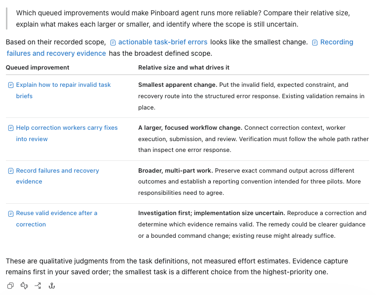

# Pinboard

## Keep your coding agent building the product you meant


Working with a coding agent can stay fluid: follow an idea, ask for the change, and keep moving. But the backlog grows. Ideas lose their context, priorities become unclear, and unfinished work gets harder to pick up.

Pinboard helps you keep that backlog useful through the conversation you already have with your coding agent. It records tasks, priorities, dependencies, and the decisions behind them beside the repository.

That context carries into delivery. Accepted direction becomes a precise brief for implementation and a separate review: defects return for correction, while choices that change scope or behavior return to you instead of silently reshaping the request. Later sessions continue from recorded scope, progress, and evidence rather than forgotten choices or assumptions.

<br clear="right">
<br>

[](https://github.com/valsteen/pinboard/actions/workflows/ci.yml)
[](https://www.python.org/downloads/)
[](https://docs.astral.sh/uv/)
[](LICENSE)

## What Pinboard does

You decide what belongs in the product. You accept or reject proposed work, settle choices that change scope or behavior, and choose what happens to a reviewed change in the repository.

Pinboard keeps those decisions attached to the work. It:

- preserves ideas without quietly starting them;
- saves your explicit priority order and dependencies;
- turns accepted direction into a stable brief;
- carries that direction through implementation and a separate review of both the request and the change; and
- restores the decision, current work, and evidence after an interruption.

The coding agent operates that workflow and brings material choices back to you in ordinary language.

## Explore your backlog in conversation

The same context that guides implementation also helps your agent reason about what comes next. Ask it to compare tasks, explain dependencies, or identify work that fits your current goals.

Here, the agent uses Pinboard's own backlog to compare the relative size of queued improvements and explain where their scope remains uncertain.

<picture>
  <source media="(prefers-color-scheme: dark)" srcset="assets/pinboard-work-selection-dark.png">
  
</picture>

The answer links to the recorded tasks and makes qualitative judgments, not measured effort estimates. The smallest apparent change differs from the first task in the saved priority order, and existing evidence reuse may already suffice. Comparing work does not start implementation.

## Skills

Use `$pinboard` in Codex or `/pinboard:pinboard` in Claude Code. This is the main entry point when you want to preserve work, decide what should happen next, or start an existing item.

You can ask naturally:

> Save this database concern for later without changing the current task.

> What should we work on next?

> Start the accepted API cleanup.

Pinboard may activate a specialized skill automatically when the work calls for it. You can also invoke one directly:

- **Technical Writing** — `$technical-writing` or `/pinboard:technical-writing` — Shape substantial technical documents and human-facing project artifacts.
- **Repository Readiness** — `$repository-readiness` or `/pinboard:repository-readiness` — Map an unfamiliar repository before making reliable changes.
- **Slop Cleanup** — `$slop-cleanup` or `/pinboard:slop-cleanup` — Remove abandoned code and the residue it leaves behind.
- **Maintaining Agent Guidance** — `$maintaining-agent-guidance` or `/pinboard:maintaining-agent-guidance` — Put durable instructions at the owner that can keep them true.

These skills specialize part of the work. They are not alternate ways to start or manage Pinboard.

## When Pinboard is worth it

Pinboard is most useful when a decision must survive more than the current conversation. That may mean another revision, interruption, reviewer, or task. When work lives that long, ideas can disappear before they become work, accepted decisions can remain after becoming obsolete, architectural assumptions can outlive the evidence that invalidated them, and changes can accumulate until no one can trace why they belong.

The drift is co-authored. Sometimes your former self made the forgotten choice. Sometimes the agent filled a gap, and plausible language made the guess look intentional. As notes, code, and reviews reinforce one another, both of you can mistake momentum for direction.

**The tradeoff:** Pinboard makes the first delivery slower because discoveries, scope, and evidence are recorded before and during implementation. That cost pays back across another revision, interruption, reviewer, or task. For small or disposable work, using the coding agent directly is often the better choice.

[How Pinboard works](HOW_IT_WORKS.md) follows the complete workflow and the decisions behind it.

## Install from GitHub

Pinboard supports macOS and Linux. Codex is the primary, stress-tested integration.

### Codex

Add this repository as a marketplace, then install Pinboard:

```sh
codex plugin marketplace add valsteen/pinboard
codex plugin add pinboard@pinboard
```

Start a Codex task in the repository and ask:

> Set up Pinboard here and explain how I can use it from one task or several tasks.

### Claude Code

Add this repository as a marketplace, then install Pinboard:

```sh
claude plugin marketplace add valsteen/pinboard
claude plugin install pinboard@pinboard
```

Start Claude Code in your project. The first session prepares the installed version's private runtime, which needs [uv](https://docs.astral.sh/uv/). Because the `pinboard` MCP server starts before that preparation finishes, the first session reports it as failed: reconnect it with `/mcp` or restart Claude Code once, then ask Claude Code to set up Pinboard there. Running `~/.claude/plugins/cache/pinboard/pinboard/*/scripts/pinboard --prepare-runtime` yourself before the first session avoids that one reconnect.

Once prepared, the plugin approves its own MCP tool calls automatically, so Pinboard does not prompt for each tool while your saved deny and ask rules still apply. The [installation guide](INSTALL.md#permissions) explains how to be asked instead and the settings-rule fallback.

<details>
<summary>Try Pinboard for one Claude Code session without installing it</summary>

```sh
git clone https://github.com/valsteen/pinboard.git
/path/to/pinboard/scripts/pinboard --prepare-runtime
claude plugin validate /path/to/pinboard --strict
cd /path/to/your-project
claude --plugin-dir /path/to/pinboard
```

</details>

The [installation guide](INSTALL.md) covers first setup, Codex and Claude Code permissions, linked worktrees, the Claude Code routes, local data, and troubleshooting.

## Local data

Pinboard keeps project decisions and evidence in the managed repository's ignored `.pinboard` directory, shared by primary and linked worktrees, and never creates or borrows a Python environment in your project. The [Local data](INSTALL.md#local-data) section of the installation guide covers the exact locations, the CLI's role, and migrating an older `.codex/pinboard` layout.

Exact invocation capture is off by default. Contributors can enable private project or item traces for ordinary Pinboard work, or use the existing one-off CLI and dedicated MCP capture forms. Exact values may contain secrets and are never automatically redacted. [The contributor guide](CONTRIBUTING.md#diagnose-pinboard-invocations-during-contributor-work) explains the opt-in, trace location, retention, and diagnosis workflow.

## Learn more

- [How Pinboard works](HOW_IT_WORKS.md) follows the workflow from an idea to an accepted, reviewed change.
- [Install Pinboard](INSTALL.md) covers advanced setup, Codex and Claude Code permissions, linked worktrees, local data, and troubleshooting.
- [Contributing](CONTRIBUTING.md) covers the development environment, checks, tests, and packaging.
- [Architecture](ARCHITECTURE.md) describes system ownership, boundaries, limitations, and failure semantics.
